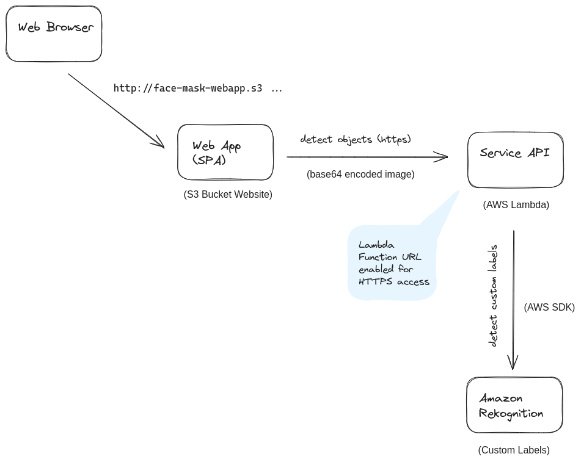

# Face Mask Detection

## Introduction

A cloud-based machine learning implementation, where the client-side (web browser) sends image data to the server-side (AWS infrastructure) to perform object detection and returns the results back to the client. This architecture allows for scalability, as AWS Lambda can handle many requests, and Amazon Rekognition provides the machine learning capabilities without the need for managing the underlying infrastructure.

## Machine Learning Model

The machine learning model for object detection process, including gathering and processing data, annotating images, augmenting the dataset, and training two types of models: a recognition model and a YOLO v8 model.

See [Machine Learning Model](./model/README.md) for details.

## Web Application

The web application is a Single Page Application (SPA) created with the React library. It allows the user to upload an image and see the results of the object detection process.

See [Front-end](./front-end/README.md) for details.

## Service

This service receives requests from the web app, which includes the detection tasks. The image data is received as a base64 encoded string to the Lambda function.

See [Lambda](./lambda/README.md) for details.