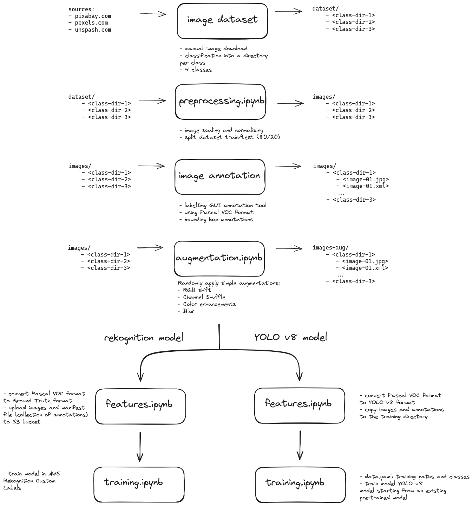

# Object Detection Models

Image Recognition/Detection project for detection of people with and without medical mask.

## Procedure Overview



## Classes

- **medical-mask (MM)**: Depicts one medical mask without any person, with or without a background.
- **person-mask (PM)**: Represents one individual with one medical mask, either not wearing the mask or wearing it inappropriately.
- **person-masked-medical (PMM)**: Illustrates one person correctly wearing a medical mask.
- **person-masked-non-medical (PMN)**: Displays one person wearing a non-medical mask.

## Create virtual env and install libraries
```bash
python3.11 -m venv .venv
pip install -r requirements.txt
```

## Image Annotation

The labelImg utility is used to create bounding box annotations after image preprocessing. The annotations are created in the PascalVOC format and later converted as needed for each model.

### Install labelImg
The `labelImg`  is not currently being updated, and some runtime errors arise with recent Python versions. To overcome this issue, a conda environment is created as follows:

```bash
conda create --name label-img  python=3.9
conda activate label-img
pip install pyqt5==5.15.2 lxml labelImg
```

> The file `class_names.txt` is created by the preprocessing Notebook.

## Amazon Recognition

See [rekognition](./rekognition)

## Open-source model

See [YOLO v8](./yolov8)
